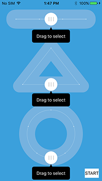
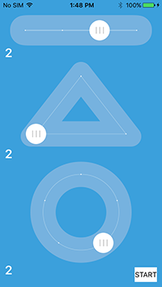

# CMSlider #
A collection of draggable controls, have fun.





# Installation #
## Cocoapods: ##

1. Add `pod 'CMSlider', '~> 0.0.1'` to your Podfile.
2. Run `pod install` or `pod update`.

# Usage #

```objc
#import <CMLineSlider.h>
#import <CMTriangleSlider.h>
#import <CMCircleSlider.h>

self.lineSlider = [[CMLineSlider alloc] init];
[self.lineSlider addTarget:self action:@selector(lineSliderValueChanged:) forControlEvents:UIControlEventValueChanged];

self.triangleSlider = [[CMTriangleSlider alloc] init];
[self.triangleSlider addTarget:self action:@selector(triangleSliderValueChanged:) forControlEvents:UIControlEventValueChanged];

self.circleSlider = [[CMCircleSlider alloc] init];
[self.circleSlider addTarget:self action:@selector(circleSliderValueChanged:) forControlEvents:UIControlEventValueChanged];
```

# Requirements #
This library requires a deployment target of iOS 6.0 or greater.

# LICENSE #
CMSlider is provided under the MIT license. See LICENSE file for details.

